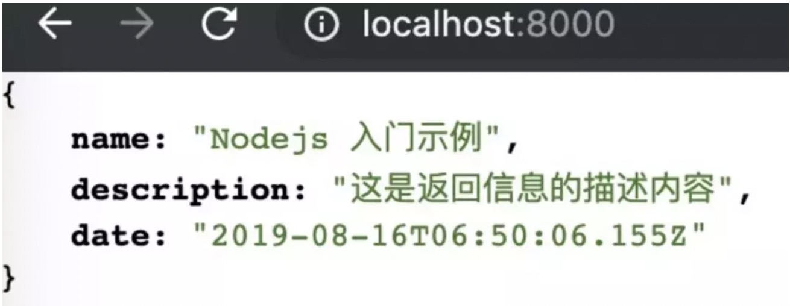
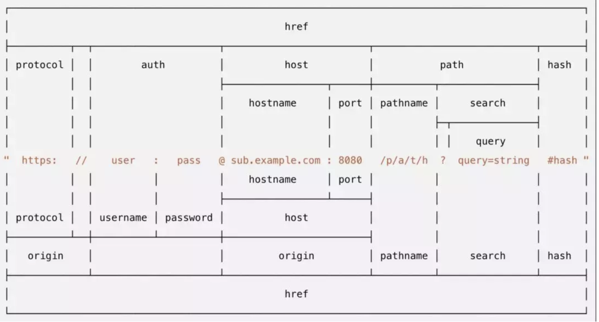
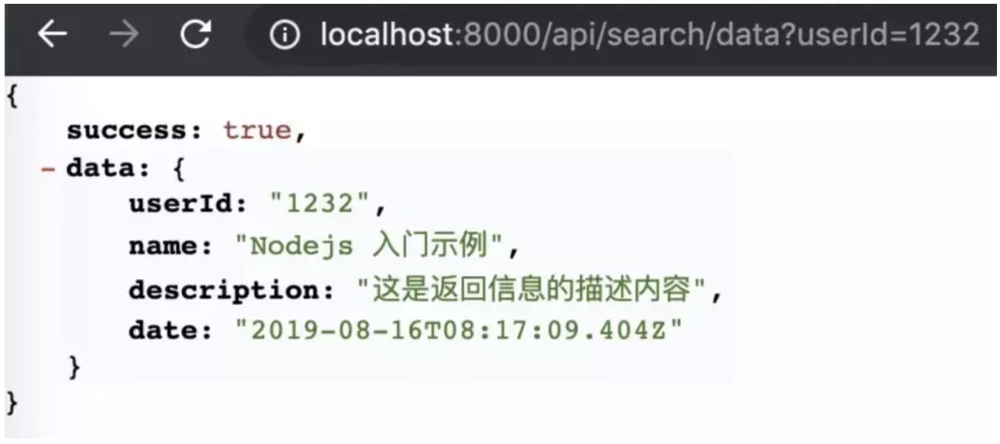
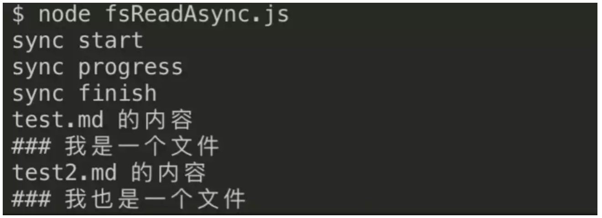
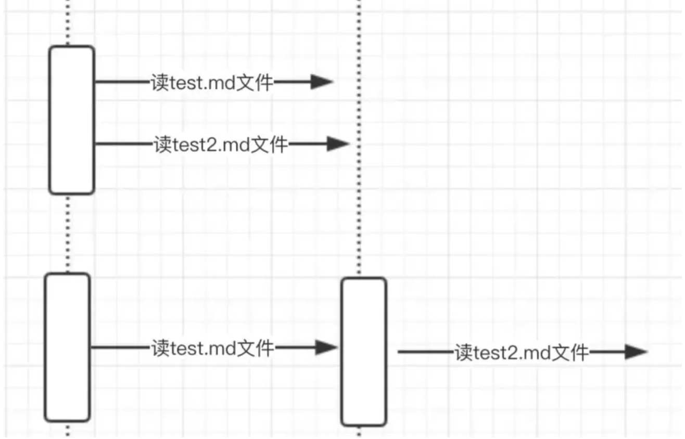
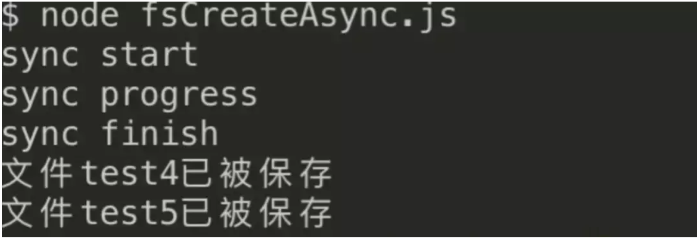

我在做什么, 我拿时间换了什么... 											---me

> 九月计划---每天利用下班后的两个学习把Node啃掉! 这是我的学习笔记, 希望这可以做为一个坚持下去的动力!

<!-- more -->

### 前言

Nodejs 能够做什么，可以解决一些什么样的问题，它的使用场景...
如果你有兴趣，请记住一定要自己动手，哪怕照着实例写一遍，真真实实的感受代码运行时的喜悦与兴奋，激发自己对新领域的兴趣。

> 默认你已经安装了 Nodejs 和 npm 包管理器，并且熟悉一些简单的操作，如 nodejs 代码的运行启动，npm 包的安装命令等基础操作。


### 第一个服务端应用

##### 1. hello world

首先通过一个前端工程师最常接触却不属于前端范畴的内容去了解一下 Nodejs，创建一个 http 服务。这里使用 Nodejs 自带的 http 模块创建一个 http 服务，你可以使用通过浏览器或者命令行来发起一个 http 请求，直观的感受服务端的 JavaScript。

```JS
// http.js
const http = require('http')

http.createServer((req,res)=>{
	res.end('Hello World !')
}).listen(8000,()=>{
	consoloe.log('listen on 8000')
})
```

上面的例子中，通过使用 node 自带的 http 模块，调用其 http.creatServer 方法在本机上开启了一个 http 服务，监听了本地的 8000 端口，代码逻辑很简单，当接收到一个 req 请求时，调用 res.end 返回一个字符串 "hello world" 给带客户端，旨在让你对 Nodejs 有一个直观的体验。

可以使用 node http.js 命令来执行这段代码，通过浏览器来访问 http://127.0.0.1:8000 或者 http://localhost:800 来查看结果。


一个由 Nodejs 的 http 服务提供的 hello world 跑起来了，简洁快速吧。接下来再来实现一个前端工作中与服务端最紧密的内容来看看 Nodejs 的魅力，数据接口。

##### 2. 如何提供一个 API

首先这里确定所要提供的 api 是我们最常用的 json 格式，所以我们要注意后端返回给前端的数据类型。

```JS
const http = require('http');

const data = {
  name: 'Nodejs 入门示例',
  description: '这是返回信息的描述内容',
  date: new Date()
};
http.createServer((req,res)=>{
	res,setHeader('Content-Type', 'application/json;charset=utf-8')
	const result = JSON.stringify(data)
	res.end(result)
}).listen(8000, ()=>{
	console.log('listen on 8000')
})
```

上例子中，先确定了一个数据模型 data，内部一共有三个字段。这里的数据模型就是前端开发前与后端所定义的返回格式，最终前端要拿到这个 JSON 格式的数据在客户端进行处理。代码逻辑相比于 Hello World，规定了返回的数据格式，以及设定了返回请求的文本类型为 application/json，然后调用 res.end 返回到客户端。



可以继续使用浏览器发起 http 请求来查看结果，一个简单且熟悉的 JSON 数据接口已经完成了。你可以按照前端最常用的调用方式，如 ajax 或者 axios 来请求接口来在你的前端项目使用它。

但是上面例子中的接口和我们常用的接口有一个差异点，就是接口名称和返回内容均不规范，使用者直接通过没有路径的 http://127.0.0.1:8000 来使用接口，这跟我们日常使用的接口是完全不一样的，那我们接下来再看一下如何给提供一个规范化的接口呢？

##### 3. 一个规范的接口

规范的接口具备哪些条件呢？简单总结一下。

> 接口名称：接口名称要体现出大致的使用场景，例如增删改查的动作。
> 
> 接口返回：接口返回要有规范化的标识，如成功与否错误内容等。

接下来通过上面这两个点，按照标准的接口规范来实现一下上面的接口，看看 Nodejs 是如何给前端提供接口的。这里先约定要提供的接口名称内含 api 标志，api 所要做的动作等一些关键信息。如下格式：

> http://localhost:8000/api/search/data?userId=12345

```JS
const http = require('http')
const url = require('url')
const qs = require('quertstring')

// 生成一段返回值
const getResponse = userId =>({
	success: true,
	data: {
		userId,
		name: 'NodeJS',
		description: '这是返回的信息',
		date: new Date()
	}
})

// http 服务
http.creatServer((req,res)=>{
	res.setHeader = ('Content-Type', 'application/json;charset=utf-8')
	const reqUrl = url.parse(req.url)
	// 判断接口路径是否是约定好的
	if(reqUrl.pathname === 'api/search/data'){
		// 获取链接上传来的URL参数
		const uid = qs.parse(reqUrl.query).userId
		// 生成返回值
		const result = JSON.stringify(getResponse(uid))
		res.end(result)
	}else{
		res.writeHead(404)
		res.end('NotFund')
	}
}).listen(8000,()=>{
	console.log('listen on 8000')
})
```

上面的例子中，新使用 Nodejs 另一个自带的模块 url，url 模块顾名思义是一个处理 href 的库，它将 href 拆分成各个子内容，同时为了能处理客户端带来的 userId 参数还使用了自带的 querystring 模块，它可以将链接上问号后的 query 参数获取到，以便服务端代码能使用他们，他们均属于工具库，下面看看官方对于 URL 模块将 href 拆分的颗粒度图，清晰的了解一下一个请求链接，可以被拆分成什么颗粒度。



实例中的源码简单解析一下，当服务接收到请求时，先判断请求的 api 名称是不是事先约定好的 / api/search/data，判断通过后，将前端传递在链接上的参数 userId 获取到，处理后插入到返回的 json 数据中，即可通过 res.end 来下发数据，如果路径判断失败，则返回 404 的状态码，并且进入 Notfund 页面，



一个规范的接口已经开发完成了，简单总结一下，上面以渐进式的方式了解了 Nodejs 如何给前端来提供一个规范化的 http 接口，了解了服务端的 JavaScript 所具备的能力，接下来再从另一个前端工程师比较少接触的内容——文件操作，来进一步了解 Nodejs。

### 文件操作那些事

对于文件操作相关的内容，前端程序员一般是不会触及的，而且 JavaScript 语言本身也并没有暴露操作文件的方法。而在 Nodejs 中，本身便提供了 fs 文件操作模块，这个模块模块底层并不是 JavaScript 来编写的，是具备操作文件的 C++ 语言编写的，其封装完成后将上层暴露给 Nodejs，然后便可以使用 JavaScript 的语法来调用它。

##### 1. 读一个文件

在 Nodejs 中，读文件有两种形式，一种是同步的另一种是异步的，同步可以理解为读文件这个过程要等待，就是一旦执行的读这个操作的时候，你的代码就被” 卡 “住了，直到文件读完才能继续执行，来看看下面的例子。

> 先新增一个 test.md 文件配合读操作，文件内容为：### 我是一个文件

```JS
// fsread.js
const fs = require('fs');

const file = fs.readFileSync('./test.md', 'utf8');

console.log(file);

```

使用 node fsread.js 来运行上面的代码，从上面简单的几行你就可以发现成功将 test.md 文件里的内容读出来，可以打印到了命令行 console 里，突然发现 JavaScript 语言的强大了吧，很神奇吧。

但是 Nodejs 天生是为异步而生的，所以必须要体验一下异步读文件是怎么的过程，与同步的表现有何异同。所以 下面示例一个异步回调的方式去读一个文件，异步的意思就是读文件这个操作进行的同时，读操作下面的 JavaScript 代码也在执行，就如同我们熟悉的软件后台运行一样，你可以继续你的桌面操作。

```JS
const fs = require('fs');

console.log('sync start');

fs.readFile('./test.md', 'utf8', (err, data) => {
  console.log('test.md 的内容');
  console.log(data);
});

console.log('sync progress');

fs.readFile('./test2.md', 'utf8', (err, data) => {
  console.log('test2.md 的内容');
  console.log(data);
});

console.log('sync finish');

```

在上面的例子中，要求是一次读取两个文件，两个文件之间并没有相关依赖性，所以这种 场景下我们更希望他们各做各的，无需去等。所以没有必要像上面同步的方式，等第一个结束再进入第二个的读取，所以使用异步方式更合适。  



从上面的执行结果也可以看出来，fs.readFile 这个异步回调操作均在三个同步代码 console 的后面，并没有像同步等待读操作的结束。

下面来个图看看这个同步 API 和异步 API 有何异同。



图片上半部分是异步读文件，可以看出来，读的操作可以理解为同时刻执行的。

图片下半部分是同步读文件，第二个读的操作需要先等待第一个读完才可以。

举个现实生活中同步的场景，运动会接力赛，A,B 两个班比赛接力，虽然 A,B 两个班无依赖，但是 A 班的第二名同学则需要第一名同学的接力棒拿到后才可继续跑，此时 A 班的运动员之间就属于同步阻塞类型。

在举个异步的场景，老板通过全员会议下达了一个任务，任务是大家做一百个俯卧撑，谁先做完任务则可以领取 10000 元红包的奖励，大家听到后纷纷原地做起，在这时候各个员工之间就是异步的，他们各做各的，谁先做完就可以执行老板给他们的开始说的领取奖励操作，这个操作可以理解为异步回调函数。

##### 2. 写一个文件

Nodejs 写文件也是有两个类型，同步与异步，实际执行流程与上面的 “读” 是一样的。

下面进入同步读文件的例子，执行下面的代码你会发现多了一个 test3.md 文件，并且写入'### 我是测试文件 test3'的内容

```JS
const fs = require('fs');

const body = '### 我是测试文件test3的内容';
fs.writeFileSync('./test3.md', body);

```

再来看一下异步写一个文件的例子，做一个对比。

```JS
// 来一个异步的看看。
const fs = require('fs');

const body = '### 我是测试文件test4的内容';
fs.writeFile('./test4.md', body, (err) => {
  if (err) throw err;
  console.log('文件test4已被保存');
});

const body2 = '### 我是测试文件test5的内容';
fs.writeFile('./test5.md', body2, (err) => {
  if (err) throw err;
  console.log('文件test5已被保存');
});

```

这是写文件的结果，这时候你的本地会多出两个文件 test4.md 和 test5.md 出来。



##### 3. 其他文件操作

其实 Nodejs 提供了丰富的文件操作接口，除了读写，还有像复制，给文件授权，删除一个文件，文件夹的操作，文件内容的监听等，如果你有对文件的操作需求，请先在文档查一下看是否能够满足你。

> 文档地址：http://nodejs.cn/api/fs.html

下面来一个文件内容监听的例子，带你看看一个文件变化时也能被观察到乐趣。

```JS
const fs = require('fs');

fs.watch('./test6.md', 'utf8', (eventType, filename)=>{
  // eventType 是 'rename' 或 'change'，
  // filename 是触发事件的文件的名称
  console.log('eventType', eventType);
  console.log('filename', filename);
});

```

我将 test6.md 的内容进行手动的变化，并且改了名字，这里都被监听到了，是不是很有趣，跟我一起来练习吧。


### 总结

本文从前端工程师们最常接触却又不属于前端领域的两个方面，http 服务与文件操作展开了学习，从几个简单易懂的例子带领去了解了 Nodejs。其实Node非诚简单便捷，几行代码就能做出一些想要的效果，能快速的完成要求。
